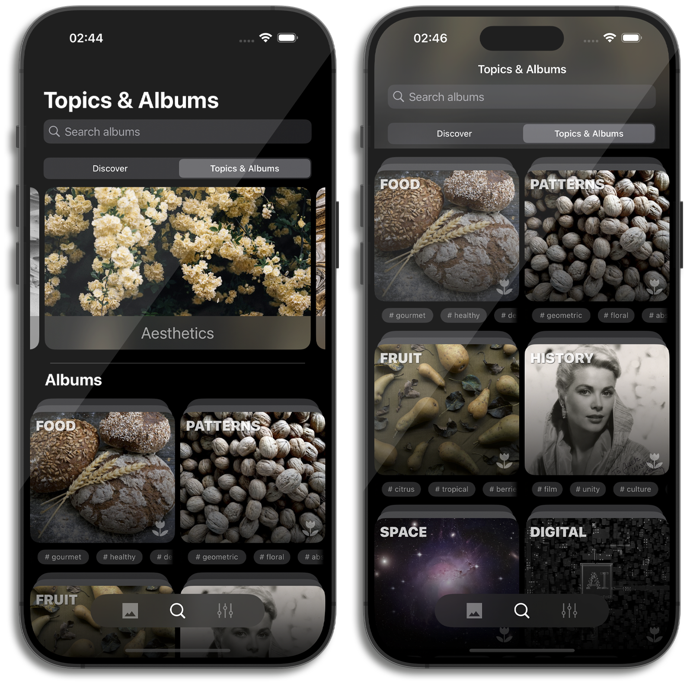

# Snjør

A mobile application built with Swift, utilizing the [Unsplash](https://unsplash.com) • [API Documentation](https://unsplash.com/documentation) to search and display images. It follows the MVVM architecture and uses Coordinators for navigation.

## No Storyboards or XIBs

This project is implemented entirely programmatically without using Storyboards or XIB files.

## Requirements
- iOS 16.0 +
- Swift 5.5 +

## Architecture:
- MVVM + Coordinators

## Technologies:
- **Languages & Frameworks**:
  - Swift
  - UIKit
  - Combine
  - Photos (for managing photos and albums)

- **Data Storage**:
  - UserDefaults

- **Concurrency**:
  - async/await for handling asynchronous operations

## Installation:
1. Clone the repository:
   ```bash
   git clone https://github.com/AdamMirzakanov/Snjor
   ```

## Screenshots:





