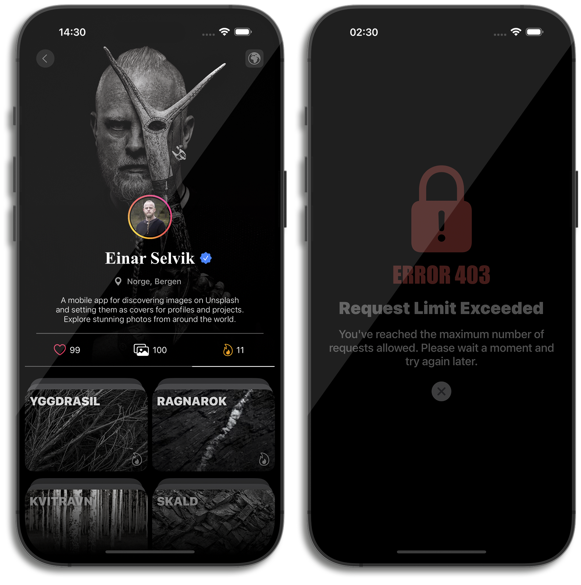

# SNJØR


---

A mobile application built with Swift, utilizing the [Unsplash](https://unsplash.com) • [API Documentation](https://unsplash.com/documentation) to search and display images. It follows the MVVM architecture and uses Coordinators for navigation.

## No Storyboards or XIBs

This project is implemented entirely programmatically without using Storyboards or XIB files.


## Development Tools
- **Code Quality**:
  - SwiftLint (used to enforce Swift style and conventions)

## Requirements
- iOS 16.0 +
- Swift 5.5 +

## Architecture:
- MVVM + Coordinators

## Technologies:
- **Languages**:
  - Swift
  
- **Frameworks**:
  - UIKit
  - Combine
  - Photos (to interact with the gallery)
  - SafariServices (it is used to open external links)

- **Data Storage**:
  - UserDefaults

- **Concurrency**:
  - async/await

- **Data Handling**:
  - UICollectionViewDiffableDataSource

## Installation:
1. Clone the repository:
   ```bash
   git clone https://github.com/AdamMirzakanov/Snjor
   ```

## Screenshots (iPhone 16 Pro Max)



## Contact

- **Email**: adamirzakan@gmail.com
