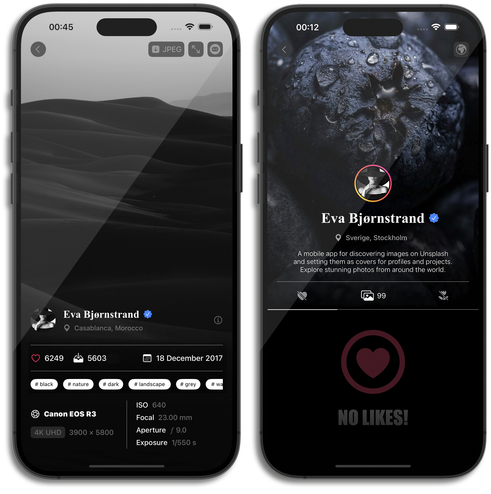

# Snjør

A mobile application built with Swift, utilizing the [Unsplash](https://unsplash.com) • [API Documentation](https://unsplash.com/documentation) to search and display images. It follows the MVVM architecture and uses Coordinators for navigation.

## Features:
- Image search on Unsplash

## Technologies:
- Swift
- UIKit
- Combine
- async/await for handling asynchronous operations

## Architecture:
- MVVM + Coordinators

## Installation:
1. Clone the repository:
   ```bash
   git clone https://github.com/AdamMirzakanov/Snjor
   ```

## Screenshots:





